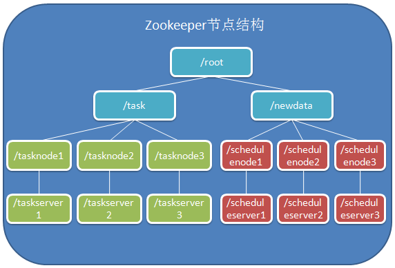

# 基于zookeeper的分布式并发任务调度

> 注意：该项目是个人开发，提出一个支持分布式任务调度的方案，希望可以起到抛砖引玉的作用，代码中的瑕疵请包涵

 

## 已实现功能

#### 1. 支持任务分布式并发执行（也就是多节点多任务同时执行）
#### 2. 具备任务执行错误补偿机制
#### 3. 具备服务故障任务转移机制（也就是一个任务节点挂了，它剩下的任务交给别的节点做）
#### 4. 支持非幂等性任务

 

## 暂不具备的功能

#### 1. 暂不支持优先级任务
#### 2. 没有监控

 

依赖zookeeper的几个特性
----
#### 1. 创建的临时节点当对应服务session断掉时会自动删除
#### 2. CreateMode.EPHEMERAL_SEQUENTIAL 可以创建自增的临时节点
#### 3. 用到了这两个监听事件：EventType.NodeDataChanged     EventType.NodeChildrenChanged
#### 4. zookeeper更新数据时自带乐观锁

 

原理说明
----
 

 

#### 结构说明
* /root是这套结构的根节点，左侧是任务执行部分，右侧是数据调度部分
* /newdata节点存储的是将要执行的新数据，/task节点存储的是分配好的数据
* /schedulenode和/scheduleserver是临时调度节点对应着的调度服务
* /tasknode和/taskserver是临时任务执行节点对应着的执行服务
* 任务节点监听/task的NodeDataChanged
* 调度节点监听/newdata的NodeDataChanged和/task的EventType.NodeChildrenChanged

#### 过程说明

* 当有新的数据要执行时，把数据存储到/newdata下，这时调度节点会收到监听开始对这些新数据进行分配，把分配好的数据+对应的任务节点的name保存到/task下，这时任务节点会收到监听通知，每个任务会从/task下取数据，执行它自己的那一部分，执行完成后，会把/task和/newdata下的对应数据删除掉。
* 如果在执行过程中，有部分任务出错，那么该节点会把出错的任务记下来，当这部分任务全部处理完后，把错误的任务数据重新写回到/newdata下，让调度节点来重新分配，再次执行上述过程。
* 如果在执行过程中，任务节点突然down了，这时就需要明确知道哪些数据执行完了，哪些数据还没执行，我这里的做法是每成功执行一条数据，都保存起来（我这里用的是memcache来保存，增加了第三方依赖，感觉比较笨，目前没想到好办法）。当任务节点down了，调度节点会收到监听通知（因为对/task做了NodeChildrenChanged监听）, 这时调度节点会把所有分配给这个节点的数据找出来，去掉已经成功执行了的（memcache里拿），把剩下的重新做分配。
* 任务服务创建的都是临时节点，即新启动一个服务，就会对应一个zookeeper的临时节点，任务停掉，这个节点也会自动被删除掉。而调度节点在分配数据时，都会获取最新的任务节点，所以加减节点不受影响。

